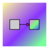

# transformer



Simple transformer function with async and sync runners.

## Why

This package provide a simple abstraction for generic conversions of data in a project, allowing single, linear and parallel transformations based on a single transform function set at creation.

## Usage

The package provides two Transformers:

```typescript
import Transformer, { TransformerAsync, TransformerSync } from '@giancarl021/transform';

console.log(Transformer === TransformerAsync)
// true
```

### Base Types

Some auxiliary TypeScript types and interfaces are used to compose the types of this library:

```typescript
type Awaitable<T = void> = T | Promise<T>;

type BaseFunction<Input, Output> = (argument: Input) => Output;

type SyncTransformFunction<Input, Output> = BaseFunction<Input, Output>;

type AsyncTransformFunction<Input, Output> = BaseFunction<
    Input,
    Awaitable<Output>
>;

type LoggerFunction = (message: string) => Awaitable;
```

### `TransformerSync`

This transformer is made for synchronous contexts, mostly when using `Promise`-based operations is not available or desired:

```typescript
/**
 * A Transformer for synchronous applications, with only sequential transformations.
 * This transformer does not allow asynchronous transform functions
 */
export function TransformerSync<Input, Output>(
    transformFunction: SyncTransformFunction<Input, Output>,
    loggerFunction: LoggerFunction = emptyLogger
): TransformerSyncInstance<Input, Output>;

/**
 * A `TransformerSync` instance, containing the available synchronous methods for transformation
 */
interface TransformerSyncInstance<Input, Output> {
    /**
     * Converts a single `Input` item into a `Output` item using the `transformFunction`
     * @param input The `Input` item to be transformed
     * @returns The generated `Output` item
     */
    transformSingle: (input: Input) => Output;
    /**
     * Converts an array of `Input` items into a `Output` items array iterating one by one linearly,
     * using the `transformFunction`
     * @param inputArray The `Input` items array to be transformed
     * @returns The generated `Output` items array
     */
    transformLinearly: (inputArray: Input[]) => Output[];
}
```

### `TransformerAsync`

This transformer is made for asynchronous operations, such as concurrent execution and with asynchronous transform functions.

```typescript
/**
 * A Transformer for asynchronous applications, with sequential and parallel transformations.
 * This transformer allow asynchronous transform functions
 */
export function TransformerAsync<Input, Output>(
    transformFunction: AsyncTransformFunction<Input, Output>,
    loggerFunction: LoggerFunction = emptyLogger
): TransformerAsyncInstance<Input, Output>;

/**
 * A `TransformerAsync` instance, containing the available asynchronous methods for transformation
 */
interface TransformerAsyncInstance<Input, Output> {
    /**
     * Converts a single `Input` item into a `Promise` with an `Output` item using the `transformFunction`
     * @param input The `Input` item to be transformed
     * @returns A promise with the generated `Output` item
     */
    transformSingle: (input: Input) => Promise<Output>;
    /**
     * Converts an array of `Input` items into a `Promise` with an `Output` items array iterating one
     * by one linearly, using the `transformFunction`
     * @param inputArray The `Input` items array to be transformed
     * @returns A `Promise` with the generated `Output` items array
     */
    transformLinearly: (inputArray: Input[]) => Promise<Output[]>;

    /**
     * Converts an array of `Input` items into a `Promise` with an `Output` items array iterating one
     * by one linearly, using the `transformFunction`
     * @param inputArray The `Input` items array to be transformed
     * @param throttle The maximum amount of concurrent transformations, `undefined` to no limit
     * @returns A `Promise` with the generated `Output` items array
     */
    transformParallel: (
        inputArray: Input[],
        throttle?: number
    ) => Promise<Output[]>;
}
```
